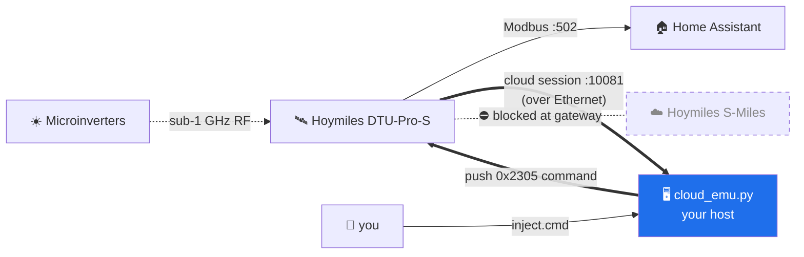

<div align="center">

# ☀️ hoymiles-dtu-offline-cloud

### Run your **OEM Hoymiles DTU‑Pro / Pro‑S completely offline** — be its cloud, on your own LAN.

No installer account. No internet. No firmware you didn't write.
Keep the real DTU — just cut the cord to Hoymiles and own it locally.


</div>

---

Hoymiles microinverter owners get two choices today: **use the S‑Miles cloud** (which
needs an *installer account* — a wall for a lot of DIY and US owners), or **rip out the
OEM DTU** and run [OpenDTU](https://github.com/tbnobody/OpenDTU) / Ahoy on an ESP32.

This is the missing middle. **Keep the OEM DTU** — its factory RF binding, its
grid‑compliance firmware, its Modbus — and point it at *your* machine as its cloud.
The reverse‑engineered protocol, a working emulator, and command push are all here.

## 🔌 How it works



The DTU only **listens** for the rich control protocol on its own Wi‑Fi AP — never on
its Ethernet port. So "control over Ethernet" works by making the DTU **dial your
emulator** as if it were the cloud, then pushing commands back down that same socket.

## ⚔️ How it compares

| | S‑Miles cloud | **This project** | OpenDTU / Ahoy |
|---|:---:|:---:|:---:|
| Keep the OEM DTU | ✅ | ✅ | ❌ (replace it) |
| Works offline / no internet | ❌ | ✅ | ✅ |
| Needs an installer account | ✅ | ❌ | ❌ |
| Blocks vendor OTA & telemetry | ❌ | ✅ | ✅ |
| Extra hardware | — | none | ESP32 |
| Remote command (reboot/shutdown/limit) | ✅ | ✅ | ✅ |

## 🚀 Quick start

Three independent pieces — use what you need.

<details open>
<summary><b>1 · Commission microinverters — no account</b></summary>

Join the DTU's own open Wi‑Fi AP `DTUP-<serialtail>` (gateway `10.10.100.254`), then:

```bash
pip install hoymiles-wifi
python commission.py --host 10.10.100.254 --local-addr <your-AP-ip> \
    --dtu-sn <DTU_SERIAL> --mi <MI_SERIAL_INT> --mi <MI_SERIAL_INT>
```
Microinverter serials are the 12 hex digits on the sticker, passed as ints —
`int("112100ABCDEF", 16)`. The DTU binds them over its sub‑1 GHz radio (they must be
**powered by their panels** to answer).
</details>

<details open>
<summary><b>2 · Point the DTU at you + trap it off the cloud</b></summary>

```bash
python set_server.py --host 10.10.100.254 --local-addr <your-AP-ip> \
    --server <YOUR_HOST_IP> --dns <YOUR_HOST_IP> --restart
```
Then block it at your gateway so it can never reach Hoymiles — regardless of the
resolver it ships hardcoded:
- **Firewall:** drop the DTU's IP/MAC to WAN; keep LAN so your host + Modbus still work.
- **DNS (optional):** sinkhole `datana.hoymiles.com` → your host, blackhole
  `fwupdate.hoymiles.com` to kill OTA.
</details>

<details open>
<summary><b>3 · Be its cloud</b></summary>

```bash
python cloud_emu.py            # binds 0.0.0.0:10081  (or run via hoymiles-cloud.service)
```
The DTU connects, registers, and stays online against you. Push a command any time:

```bash
echo "1" > inject.cmd                    # 1 = reboot the DTU
echo "7" > inject.cmd                    # 7 = shut a microinverter down
echo "8|A:1000,B:0,C:0" > inject.cmd     # 8 = power‑limit to 100.0%
```
Action codes are the `CMD_ACTION_*` values in `hoymiles_wifi/const.py`.
</details>

## 🧬 The protocol

```
┌──────┬─────────┬─────────┬───────────┬─────────┬──────────────────┐
│ "HM" │ cmd (2) │ seq (2) │ CRC16 (2) │ len (2) │ protobuf payload │
└──────┴─────────┴─────────┴───────────┴─────────┴──────────────────┘
                              CRC‑16/MODBUS over the payload · resp cmd = req + 0x0100
```

`0x2202 → 0x2302` time‑sync · `0x2201 → 0x2301` APPInfo ack · `0x2305` cloud→DTU command.
Full spec, field maps, and command list in **[PROTOCOL.md](PROTOCOL.md)**.

## 📋 Status — proof of concept

Verified on a **DTU‑Pro‑S** (`fw 2.3.0.0-de`, `sw 527`) with **HMS‑800‑2T‑NA** inverters.

- ✅ DTU→cloud handshake decoded (register / time / APPInfo / heartbeat)
- ✅ Emulator a real OEM DTU accepts and stays online against — no Hoymiles, no internet
- ✅ Command push over Ethernet — reboot verified end‑to‑end
- ✅ Account‑free `AutoSearch` commissioning over the DTU AP
- ⚠️ **TODO:** decode live `RealData` production frames (needs a DTU with bound
  inverters); more models/firmwares; a cleaner injector API

**PRs welcome** — captures from other DTU models especially.

## ⚖️ Safety & legality

This talks to **hardware you own**, for interoperability and local control — the same
spirit as OpenDTU. It touches no one else's device and, by design, not Hoymiles' servers.
Curtailment/shutdown commands act on grid‑tied equipment: know your local rules and don't
push what you don't understand. No warranty — see [LICENSE](LICENSE).

## 🙏 Credits

Protocol groundwork from [`suaveolent/hoymiles-wifi`](https://github.com/suaveolent/hoymiles-wifi)
(app→DTU) and [`henkwiedig/Hoymiles-DTU-Proto`](https://github.com/henkwiedig/Hoymiles-DTU-Proto).
The **cloud direction** — emulator, framing/CRC, and command push — was reverse‑engineered
by capturing one real DTU↔cloud session and rebuilding the server side.
